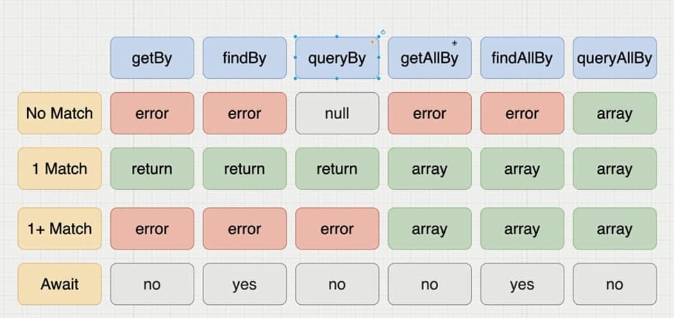

# screen has a bunch of other elements

> `findAllBy...` actually finds us `elements` that matches that `condition` as an `array` but the `findBy...` is giving us `one` element.

we have different of selectors(90% of the times you will be using get over the rest)

- findAllBy...
- findBy...
- getAllBy...
- getBy...
- queryAllBy...
- queryBy...

> the differences between these methods are as followed
> 

- the `getBy` , `queryBy` & `findBy` get `one` element but the others get `array` of elements.

- the `all` versions works similarly to their `siblings` and if we know how the `get` versions work , we automatically will be familiar with the others.

---

## priority

> in most of the times we can select an element by more that one method (getByText || getByTitle, etc.). here is the important point is that we want to mimic the user interactions as much as possible. so we should use the methods that accessible to every user

### Accessible by Everyone

1. getByRole
2. getByLabelText
3. getByPlaceholderText
4. getByText

### Semantic Queries

1. getByAltText
2. getByTitle

### Test ID

- getByTestId
